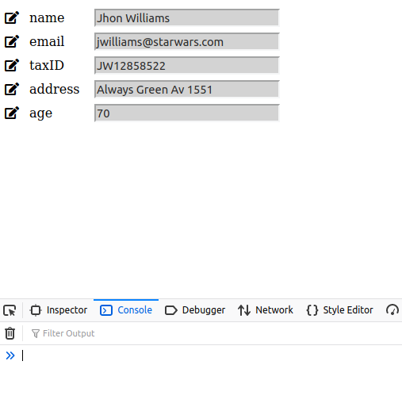
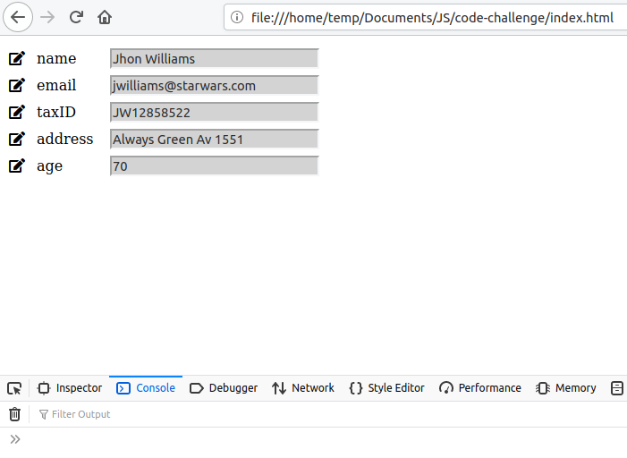
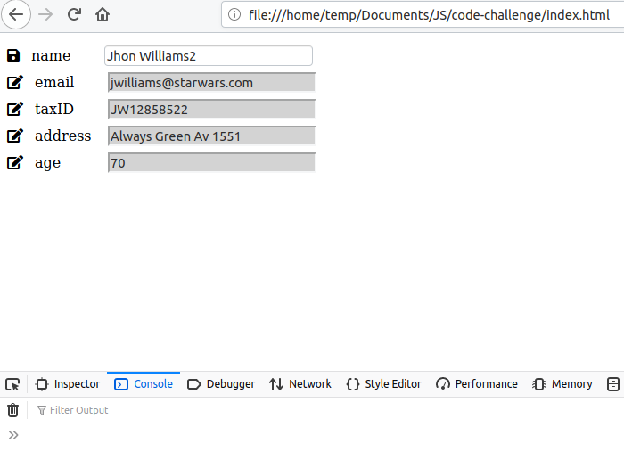
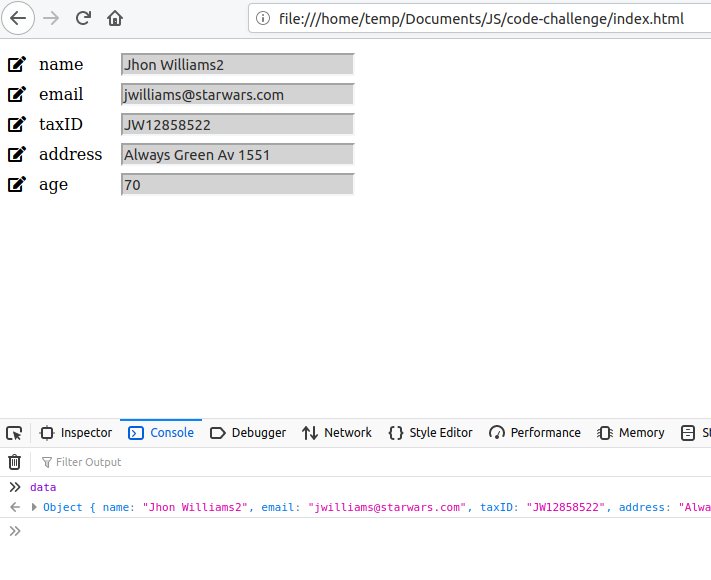

## SHOW DATA WITH JS

### How to test it?

When you load in your browser the HTML file you can see the data in each field and each label.

As you can see on the below image, it has icons in order to choose if you want to edit the data or just read it. If you want to see the change you can write *data* on your console from your browser and check the changes on each field

##### Step1. See data

##### Step2. See the icons and background color

##### Step3. Click on edit icon and edit information

##### Step4. Click on Save icon and look on console the data information

